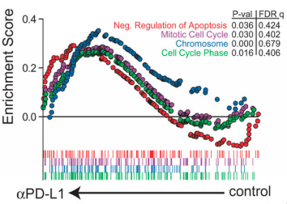

微信ID: epigenomics  E-mail: epigenomics@rainbow-genome.com

本代码作者：Guangchuang Yu

[](https://guangchuangyu.github.io/blog_images/biobabble.jpg) 

小丫编辑校验

```{r setup, include=FALSE}
knitr::opts_chunk$set(echo = TRUE)
```

### 需求描述
用R代码画出paper里四个画一起的GSEA结果图

在嘉因公众号回复“GSEA”查看详情。



出自<https://www.ncbi.nlm.nih.gov/pmc/articles/PMC5484795/>

### 使用场景
在paper里用一个图的空间展示富集的多个通路的GSEA结果。

### 输入数据的预处理

如果你已经做完了GSEA，也建议你用clusterProfiler再做一次GSEA，因为：

富集分析需要不断地维护，更新知识库；不像其它软件，写好了可以用几年。富集分析的软件非常多，但多半不能用，而多半软件是不维护的，这就是问题之所在。如果你使用Broad Institute的GSEA软件，要小心了，它的KEGG注释还停留在2012年。

所以这里我们使用`clusterProfiler`，它解决了三个问题：

一是支持大量的非模式生物；

二是支持多种知识库；

三是支持在线数据。

这是大量同类软件的短板，很多只支持GO/KEGG，只支持少量模式生物，基本不更新维护，所以这里我们要使用`clusterProfiler`，而不是用别的软件的结果，直接以实验结果（全基因组表达量）做为输入，衔接`clusterProfiler`，最后出图，完事。

做GSEA，需要一个排序文件，此处输入数据是基因组上所有基因的变化倍数：`easy_input_rnk.txt`，等同于java版本GSEA的rnk文件。

参考《[听说你有RNAseq数据却不知道怎么跑GSEA](http://mp.weixin.qq.com/s/aht5fQ10nH_07CYttKFH7Q)》

```{r}
library(clusterProfiler)
df = read.table("easy_input_rnk.txt",header = T,as.is = T)
dim(df)
head(df)
```

此处第一列是基因名，需要先转换成ENTREZID。

如果你的基因ID是其他ID，也可以用clusterProfiler转换，TCGA也用它来做转换，参考《[最靠谱的富集分析，超炫的展示方式，TCGA也是他的粉丝](https://mp.weixin.qq.com/s/Kroi9PGNbMlt2SEhqLAU1A)》

```{r,message=FALSE,warning=FALSE}
df.id<-bitr(df$SYMBOL, fromType = "SYMBOL", toType = "ENTREZID",OrgDb = "org.Hs.eg.db")
head(df.id)
dim(df.id)
#让基因名、ENTREZID、foldchange对应起来
easy.df<-merge(df,df.id,by="SYMBOL",all=F)
#按照foldchange排序
sortdf<-easy.df[order(easy.df$foldChange, decreasing = T),]
head(sortdf)
gene.expr = sortdf$foldChange
names(gene.expr) <- sortdf$ENTREZID
head(gene.expr)
```

有了这个ENTREZID和foldchange信息的`gene.expr`之后，就可以使用`clusterProfiler`进行GSEA分析了。

### 进行GSEA分析

```{r,message=FALSE,warning=FALSE}
require(enrichplot)
require(clusterProfiler)
kk <- gseKEGG(gene.expr, organism = "hsa")
```

这一条语句就做完了KEGG的GSEA分析。

另外，还可以用GO、MSigDB、以及自定义的gene set做富集分析。

### GSEA结果保存

按照enrichment score从高到低排序，便于查看富集通路

```{r}
sortkk<-kk[order(kk$enrichmentScore, decreasing = T),]
write.table(sortkk,"gsea_output.txt",sep = "\t",quote = F,col.names = T,row.names = F)
```

通过查看gsea_output.txt,选择你想画的pathway，记下通路的term ID。

### 开始画图

不需要另外准备输入文件，`clusterProfiler`直接可以用`gseaplot`出图：

```{r}
gseaplot(kk, "hsa04510")
```

当然你可以改线条颜色：

```{r}
gseaplot(kk, "hsa04510", color.line='steelblue')
```

另一种出图方式是模拟Broad institute的GSEA软件的图，可以用`gseaplot2`出图：

```{r}
gseaplot2(kk, "hsa04510")
gseaplot2(kk, "hsa04510", color = "firebrick", rel_heights=c(1, .2, .6))
```

它还有更外一个功能，就是支持同时展示多个pathways的结果

需要开发版本的`enrichplot`软件，请通过以下指令安装：

```r
devtools::install_github("GuangchuangYu/enrichplot")
```

画出enrichment score排名前4的pathway
```{r}
gseaplot2(kk, row.names(sortkk)[1:4])
```

也可以通过查看gsea_output.txt，挑出你想show的pathway，给它以hsa开头的KEGG ID
```{r}
paths <- c("hsa04510", "hsa04512", "hsa04974", "hsa05410")
gseaplot2(kk, paths)
gseaplot2(kk, paths, color = colorspace::rainbow_hcl(4))
```

如果你不想同时展示3个subplots，而只想选取其中某一些，也是可以的，通过`subplots`参数：

```{r}
gseaplot2(kk, paths, subplots=1)
#gseaplot2(kk, paths, subplots=1:2)
gseaplot2(kk, paths, subplots=c(1,3))
```

当然还可以直接把pvalue table注释在图片上

```{r fig.width=10}
gseaplot2(kk, paths, color = colorspace::rainbow_hcl(4), pvalue_table = TRUE)
```

```{r fig.width=10, fig.height=7}
gseaplot2(kk, paths, pvalue_table = TRUE)
```

`enrichplot`提供了多种可视化方式，不单单是上面展示的这些，请移步在线文档<http://bioconductor.org/packages/devel/bioc/vignettes/enrichplot/inst/doc/enrichplot.html>，想要及时了解新功能，请关注公众号[biobabble](https://guangchuangyu.github.io/blog_images/biobabble.jpg) 。

```{r}
sessionInfo()
```