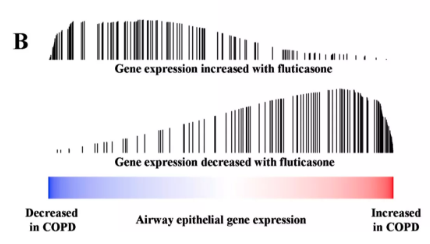

微信ID: epigenomics  E-mail: epigenomics@rainbow-genome.com

```{r setup, include=FALSE}
knitr::opts_chunk$set(echo = TRUE)
```

### 需求描述
已经用Java版GSEA做出了GSEA分析结果，想自己画图。




### 应用场景
在嘉因公众号回复“GSEA”查看详情。

### 输入数据的准备
Java版GSEA的输出文件夹中有每个通路的Excel文件，把你感兴趣的通路的Excel文件复制到当前文件夹。

读取xls文件，合并
```{r,message=FALSE,warning=FALSE}
fnames<-Sys.glob("*.xls")
fdataset<-lapply(fnames,read.delim)
names(fdataset) <- fnames
library(plyr)
result <- ldply(fdataset, data.frame)
result$pathway<-unlist(strsplit(result$.id,split = ".xls"))
head(result)
```

### 开始画图

用官方GSEA输出的Excel文件重新画图，画这种散点图最合适。如果画折线图，你会发现跟Java版GSEA输出的图像不一致。那是因为官方GSEA输出的Excel文件不是所有基因的enrichment score，它只给出了这个通路内的基因的enrichment score。

#### enrichment score画成散点图

```{r,fig.height=4,fig.width=8}
library(ggplot2)
p1<-ggplot(result,aes(x=RANK.IN.GENE.LIST,y=RUNNING.ES,fill=pathway,group=pathway))+
  geom_point(shape=21) + #选用带黑圈的点，优点是在点密集的位置也能看出有多个点
  labs(x = "", y = "Enrichment Score", title = "") + 
  scale_x_continuous(expand = c(0, 0)) + #让x和y轴都从0开始
  scale_y_continuous(expand = c(0, 0),
                     limits =c(min(result$RUNNING.ES-0.02), max(result$RUNNING.ES+0.02))) + 
  theme_bw() + #去除背景色
  theme(panel.grid =element_blank()) + #去除网格线
  theme(panel.border = element_blank()) + #去除外层边框
  theme(axis.line = element_line(colour = "black")) +
  theme(axis.line.x = element_blank(),axis.ticks.x = element_blank(),axis.text.x = element_blank()) + #去除x轴
  geom_hline(yintercept = 0) + #在0的位置画x轴
  #如果想把legend画在图的内部，例如右上角，就运行下面这行
  #theme(legend.position=c(1,1),legend.justification = c(1,1)) + 
  guides(fill=guide_legend(title = NULL)) + #隐藏由fill产生的图例的title
  theme(legend.background = element_blank()) +
  theme(legend.key = element_blank())
p1
ggsave(file="point.pdf")
```

#### enrichment score画成柱形图

类似于散点图，同样要先把该通路中基因的enrichment score提取出来。

一次画一个，画到list里

```{r,fig.height=12,fig.width=4}
library(RColorBrewer)
p2<-lapply(unique(result$pathway), function(ii) {
    dd <- result[result$pathway == ii,]
    ggplot(dd,aes(x=RANK.IN.GENE.LIST,y=RUNNING.ES))+
      geom_bar(stat="identity",colour = "black")+
      labs(x = result$pathway, y = "", title = "") +
      theme_bw() + #去除背景色
      theme(panel.grid =element_blank()) + #去除网格线
      theme(panel.border = element_blank()) + #去除外层边框
      xlim(0,max(result$RANK.IN.GENE.LIST)) +
      theme(axis.line = element_blank(),axis.ticks = element_blank(),axis.text = element_blank()) #+ #去除xy轴
})
```

画热图表示左侧下调，右侧上调

```{r,fig.height=1,fig.width=4}
t<-data.frame(a=as.numeric(1:1000),b=as.numeric(1:1000))

p3<-ggplot(t,aes(a,1,fill=b)) +
  geom_tile()+
  theme_bw() + #去除背景色
  labs(x = "treatment<--------------control", y = "", title = "") + 
  scale_fill_gradient2(low = "blue", mid = "white", high = "red",midpoint = 500)+
  scale_x_discrete(expand = c(0, 0)) + scale_y_discrete(expand = c(0, 0)) +#让x和y轴都从0开始
  theme(panel.grid =element_blank()) + #去除网格线
  theme(panel.border = element_blank()) + #去除外层边框
  guides(fill=FALSE)#隐藏由fill产生的图例
```

用cowplot组图
```{r,message=FALSE,fig.height=5,fig.width=4}
require(cowplot)
p2[[4]] <- p3
plot_grid(plotlist=p2, ncol=1,rel_heights = c(2,2,2,1))
ggsave(file="bar.pdf")
```

#### enrichment score画成折线图

如果你非要画折线图也可以
```{r,fig.height=4,fig.width=8}
library(ggplot2)
p4<-ggplot(result,aes(x=RANK.IN.GENE.LIST,y=RUNNING.ES,colour=pathway,group=pathway))+
  geom_line() + 
  labs(x = "", y = "Enrichment Score", title = "") + 
  scale_x_continuous(expand = c(0, 0)) + #让x和y轴都从0开始
  scale_y_continuous(expand = c(0, 0),
                     limits =c(min(result$RUNNING.ES-0.02), max(result$RUNNING.ES+0.02))) + 
  theme_bw() + #去除背景色
  theme(panel.grid =element_blank()) + #去除网格线
  theme(panel.border = element_blank()) + #去除外层边框
  theme(axis.line = element_line(colour = "black")) +
  theme(axis.line.x = element_blank(),axis.ticks.x = element_blank(),axis.text.x = element_blank()) + #去除x轴
  geom_hline(yintercept = 0) + #在0的位置画x轴
  #theme(legend.position=c(1,1),legend.justification = c(1,1)) + #legend画在右上角
  guides(colour=guide_legend(title = NULL)) + #隐藏由color产生的图例的title
  theme(legend.background = element_blank()) +
  theme(legend.key = element_blank())
p4
ggsave(file="line.pdf")

```

#### 画gene rank

其实只有画折线图的时候需要另外画gene rank，散点图和柱状图本身就已经显示了gene rank。

```{r,fig.height=1,fig.width=4}
p5<-ggplot(result,aes(RANK.IN.GENE.LIST,pathway,colour=pathway))+
  geom_tile()+
  theme_bw() + #去除背景色
  labs(x = "treatment<--------------control", y = "", title = "") + 
  scale_x_discrete(expand = c(0, 0)) + scale_y_discrete(expand = c(0, 0)) +#让x和y轴都从0开始
  theme(panel.grid =element_blank()) + #去除网格线
  theme(panel.border = element_blank()) + #去除外层边框
  theme(axis.line = element_line(colour = "black"))+
  theme(axis.line.y = element_blank(),axis.ticks.y = element_blank(),axis.text.y = element_blank())+ #去除y轴
  guides(color=FALSE)#隐藏由color产生的图例
p5
```


### 组合

```{r,message=FALSE,warning=FALSE}
#用gridExtra保持上下两个图各自的高度
library(gridExtra)
gA=ggplot_gtable(ggplot_build(p1))
gB=ggplot_gtable(ggplot_build(p5))
maxWidth = grid::unit.pmax(gA$widths, gB$widths)
gA$widths <- as.list(maxWidth)
gB$widths <- as.list(maxWidth)

#然后用grid组合两个图，按同一个x坐标上下对齐
library(grid)
grid.newpage()
grid.arrange(arrangeGrob(gA,gB,nrow=2,heights=c(.8,.3)))
```

### 输出文件
```{r}
pdf('prettyGSEA.pdf',width=8,height=4)
grid.arrange(arrangeGrob(gA,gB,nrow=2,heights=c(.8,.3)))
dev.off()

sessionInfo()
```